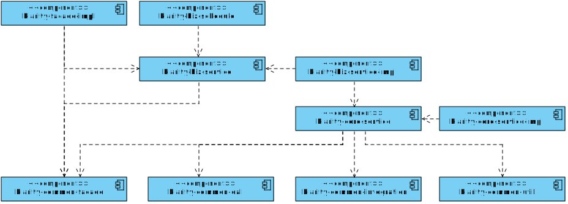

### System Architecture

#### 1、module design

```
klarity-common-facade :

XXXRequest,XXXResponse,XXXVO,
```

```
klarity-biz-service:
```

```
klarity-core-service:

XXXContext
```

```
klarity-common-integration

XXXBO
```

```
klarity-common-dal

XXEntity
```



#### 2、function architecture

business flow compose of different base abilities;

base ability represent all the abilities to operate the same information

this architecture will be modified when new requirements comes;


