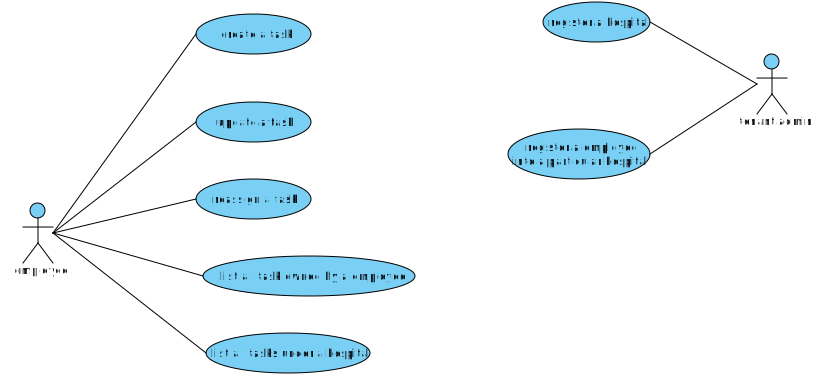
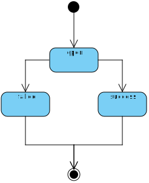

## 1. core use case
#### 1.1 role
     employee、system admin
#### 1.2 use case

## 2. sequence diagram
#### 2.1 Register a employee into a particular hospital

#### 2.2 Reassign tasks to different employees

## 3. State Machine Diagram
### 2.1 task state

## 4. Entity RelationShip Diagram

